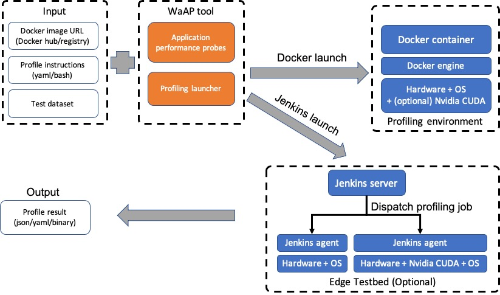

# Waggle Application Profiler (WaAP)

Waggle application profiler measures performance factors of applications and resources consumed by execution of the applications. WaAP launches target application as a container and mounts the profiling probes, test dataset, and user-provided instructions on how to run the application. Upon completion of user-instructed execution, the profiler outputs profiling result in a given format.

This tool uses Docker to deploy profiling jobs by default. However, the tool can be configured with a Jenkins server to manage multiple profiling jobs. The tool also supports GPU profiling if profiling can be performed on Nvidia GPU machine.



## Requirements

The tool requires,
- PyWaggle v0.40.5 or higher
- Docker ce 19 or higher
- Jenkins
- Nvidia CUDA driver and library (only for GPU profiling)

## Setup on ECR

- Make sure that the ECR is configured with a Jenkins job trigger. I made a job named `nvidia-nx-profiling-pipeline`, setup a user authentication token, and parameterized my build with [this config.xml file](jenkins_server/config.xml). The script accepts the following arguments at the moment:
  - App name - which app to profile
  - App arguments - how to run the app in a profiling session
  - App docker arguments - how to tell docker to run the app
- A build trigger can be issued using a curl command like the one shown in the "Run Profiling" section.
- TODO: Allow the profiler user to specify a custom timeout for their app, at the end of which the profiler script will send an interrupt signal to the process until it dies.

## Setup on target devices

- Install Jenkins on the target device (i.e. Nvidia NX). At the moment I have Jenkins installed natively, but an agent container is preferable. Currently Jenkins does not provide an arm64 image of its agent jar, so I installed Jenkins on my system directly. In the future it will be important to contain the Jenkins agent within a container.

## Run Profiling

- Issue a POST request to the Jenkins server (likely running on the ECR)

  ```
  curl -X POST --user jenkins-admin:11d09f0206a2b6a30096cb7c6a1fbf3e79 "http://169.254.117.38:8080/job/nvidia-nx-profiling-pipeline/buildWithParameters/" --data-urlencode "app_args=-stream top_live -object car -interval 1" --data-urlencode "app_name=waggle/plugin-objectcounter:0.0.0" --data-urlencode "app_docker_args=-v /home/nvidia/luke_projects/config_dir/data-config.json:/run/waggle/data-config.json"
  ```

## Output

- When the Jenkinsfile completes the execution of the app on the target device, the output metrics are in a folder in the Jenkins agent workspace. These files are `stash`ed on the NX and `unstash`ed on the Jenkins server. At the moment these files are raw profiling dumps which will need to be post-processed at a later time.
