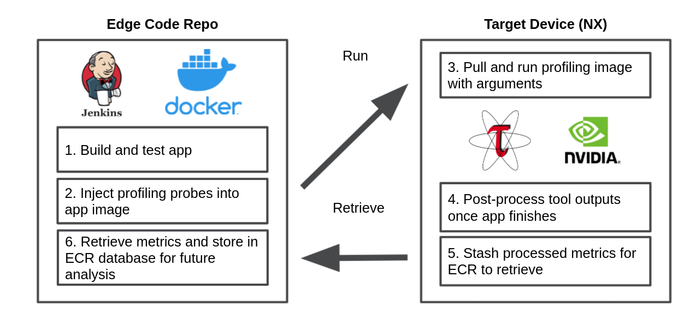
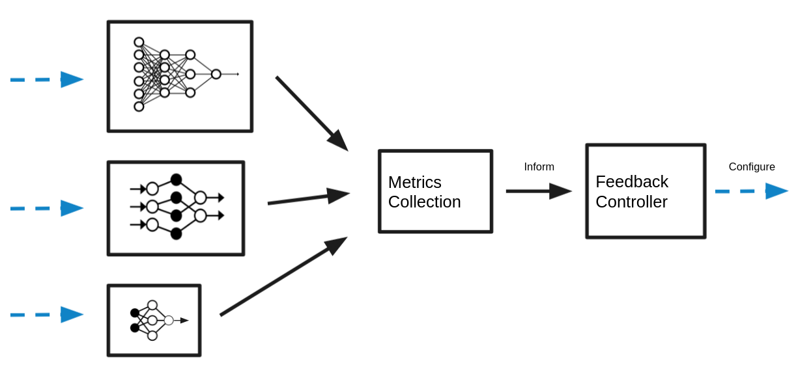

# Waggle Application Profiler (WaAP)

Waggle application profiler measures performance factors of applications and resources consumed by execution of the applications. WaAP launches target application as a container and mounts the profiling probes, test dataset, and user-provided instructions on how to run the application. Upon completion of user-instructed execution, the profiler outputs profiling result in a given format.

This tool uses Docker to deploy profiling jobs by default. However, the tool can be configured with a Jenkins server to manage multiple profiling jobs. The tool also supports GPU profiling if profiling can be performed on Nvidia GPU machine.


## Types of Profiling

At the moment, there are two experimental types of profiling: session profiling and live profiling. 

**Session profiling** uses a Jenkins pipeline to execute a fixed dataset on an NX testbed with supplementary profiling tools (`nvprof` Nvidia's profiling solution, Tau, `tegrastats` the NX's own system stats tool). Session profiling happens over a fixed period of time in a lab environment. (At the moment there are no testbeds setup for scientists to profile on, but in the future the Sage team intends to provide a testbed for session profiling.) The advantage of session profiling is that app developers can hand our system a run configuration with dataset and receive immediate feedback on how their app performs on node hardware with that run configuration. A developer who has just written a GPU algorithm or has just completed training their neural network should profile their work in a profiling session. *(TODO: Add live metrics hook features to the session profiling mode. At the moment if the app developer chooses to profile their app in a profiling session, they will not be able to retrieve high-level metrics like FPS. Those features have only been incorporated into live profiling with Prometheus.)*

**Live profiling** is similar to session profiling in that it reports the performance status of an AI application, but live profiling is (of course) happening live. Only apps that are deployed to a node are live profiled. This type of profiling is responsive to dynamic environment changes like time of day. Live profiling provides the edge controller with metrics to make resource management decisions. 

## Requirements

The tool requires,
- PyWaggle v0.40.5 or higher
- Docker ce 19 or higher
- Jenkins
- Nvidia CUDA driver and library (only for GPU profiling)

## Session Profiling Setup on ECR using Jenkins



- Make sure that the ECR is configured with a Jenkins job trigger. I made a job named `nvidia-nx-profiling-pipeline`, setup a user authentication token, and parameterized my build with [this config.xml file](jenkins_server/config.xml). The script accepts the following arguments at the moment:
  
  - App name - which app to profile
  - App arguments - how to run the app in a profiling session
  - App docker arguments - how to tell docker to run the app
  
- Issue a POST request to the Jenkins server to start a new job with a run configuration. *NOTE: This is an outdated way of communicating with the ECR server, since it has its own API endpoint and triggers the Jenkins server by itself. This code is then here for reference.*

  ```
  curl -X POST --user jenkins-admin:11d09f0206a2b6a30096cb7c6a1fbf3e79 "http://169.254.117.38:8080/job/nvidia-nx-profiling-pipeline/buildWithParameters/" --data-urlencode "app_args=-stream top_live -object car -interval 1" --data-urlencode "app_name=waggle/plugin-objectcounter:0.0.0" --data-urlencode "app_docker_args=-v /home/nvidia/luke_projects/config_dir/data-config.json:/run/waggle/data-config.json"
  ```

- When the Jenkinsfile completes the execution of the app on the target device, the output metrics are in a folder in the Jenkins agent workspace. These files are `stash`ed on the NX and `unstash`ed on the Jenkins server. At the moment these files are raw profiling dumps which will need to be post-processed at a later time.

- TODO Items

  - Allow the profiler user to specify a custom timeout for their app, at the end of which the profiler script will send an interrupt signal to the process until it dies.
  - Test the pipeline on many different types of apps (i.e. apps that use audio instead of video input, apps that require other apps running to run, apps that require a high internet connection)
  - Add a method of interacting with the Sage object store for pulling datasets

## Live Profiling with Prometheus and Edge Controls



- Live profiling code can be explored in the `live_profiling` folder
