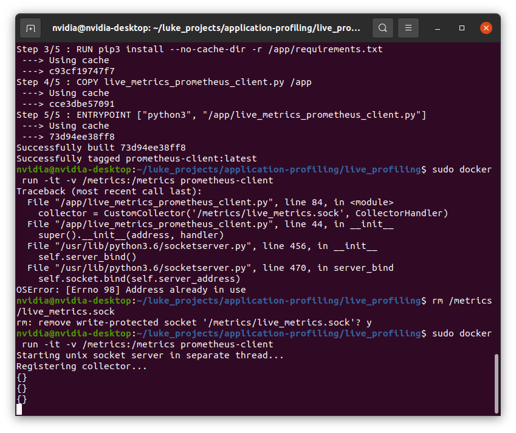
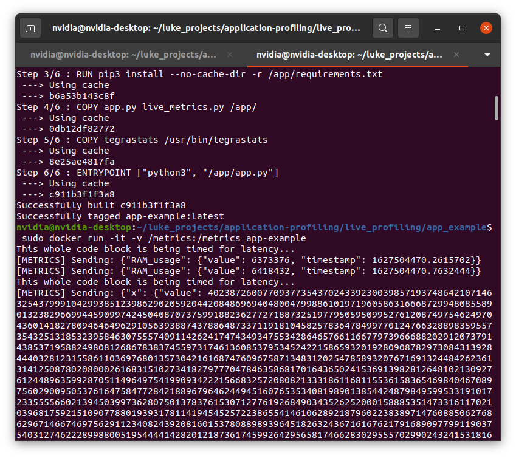
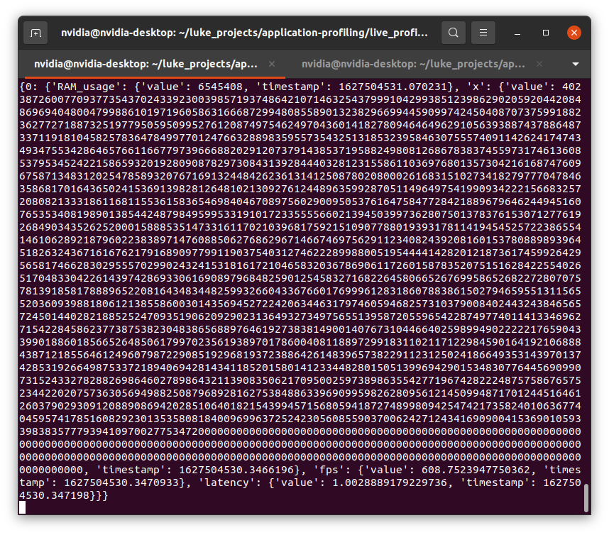

## Live Profiling with Python Library Hooks

In order to monitor application-specific metrics like FPS or latency, it is necessary to "hook into" the deployed application. Application hooks are necessary because they provide bounds for the performance profiler. A scientist can simply add two function calls surrounding code that they want to profile.

```
# Setup custom Prometheus metric exporter
metrics_service = SageAppMetricsServer({'latency': SageAppMetricsServer.METRIC_TIMER,
                                            'fps': SageAppMetricsServer.METRIC_RATE,
                                            'x': SageAppMetricsServer.METRIC_NUMBER})

# This could be a code block where FPS is relevant (I just put a useless for loop in here for example)
metrics_service.start_timer("fps")
x = 1
for i in range(1, 1000):
	x = x * i
metrics_service.push_metric('x', x)
metrics_service.stop_timer("fps")
```

In the above example, the scientist specifies the block of code that is relevant to the "fps" measurement by bookending the code block with `start_timer` and `stop_timer`. In a real application, a scientist may want to place these function calls around an inferencing function that takes a video stream as an input. (Note that these function calls consume some resources to log the timing measurements of each inference, but its cost is negligible. *TODO: Experimentally determine the overhead of running the metrics collector framework, including the in-app function calls and the separate metrics collector container.* 

## Running the Examples

First, start the custom Prometheus client app. In the repo this docker container is located in `prometheus_client_example`. This app is responsible for hosting a socket at `/metrics/live_metrics.sock`. Make sure that the `/metrics` folder is shared with this app so that the Prometheus client can create a socket file on the host filesystem. This enables the socket to be shared with the apps that will need to connect to it. Here is an example of spinning up the Prometheus client:



Note the `-v /metrics:/metrics` which maps the host folder at `/metrics` to the container folder at `/metrics`.

As the Prometheus client runs, it will handle any new connection to its socket server by launching a new handler thread. Each handler thread handles new metrics sent from apps. Every app that is reporting metrics has its own handler thread on the Prometheus client. Between all threads there is a metric table. This table is updated whenever an app reports a new value for a specific metric. In the above image you can see the Prometheus server displaying the current metric table, which of course is `{}` an empty dictionary because we have not connected any apps to it.

So let's spin up some apps! After building the container in `app_example`, you can run the container like this:



If you want to see the Prometheus client HTTP endpoint, enable `-p 9090:9090` on Docker to expose a port on the container to view the metrics.

Note that this run command also uses `-v /metrics:/metrics`. This app is now sending metrics! You can see the metrics tables updated on the Prometheus client like this:



Right now you can see `0` as the only key of the metrics table. This is the app id of the first app that has connected to the socket. Every new app that connects will be assigned a number one more than the last. 

(*TODO*) In the future it would be helpful to add an app-id field to the metrics table. That way the metrics collector could pass on more information to the edge controller to help it keep track of managing the apps. At the moment a 0...n numbering system is fine (since I haven't incorporated this into the edge controller), but in the future a more systematic approach like having the Docker container ID as the metrics table key would be helpful to add.

The advantage of using a metrics table is that some metrics can be updated at different times.