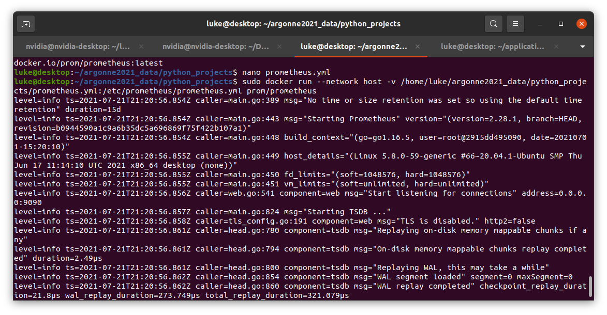
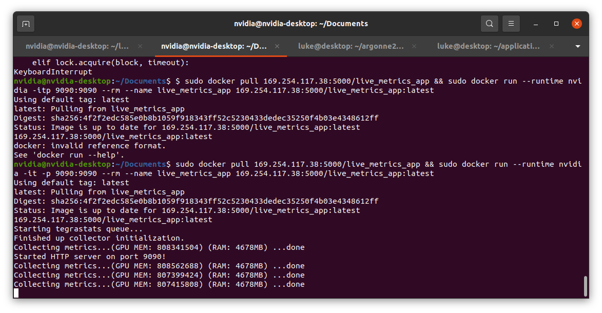
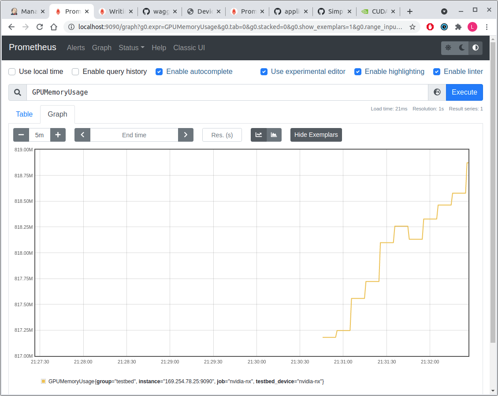

## Live Profiling App Prototype with Prometheus

### On the Server

On the server you need to pull a docker container for the Prometheus server. You can run the following:

```
docker pull prom/prometheus
```

This container is the full server instance that will be pulling live metrics from the testbed. You need to make a configuration file before you run the server, because it needs to know the testbed targets. Here is my configuration file (yours will be slightly different):

```
global:
  scrape_interval:     10s
  evaluation_interval: 5s

rule_files:
  # - "first.rules"
  # - "second.rules"

scrape_configs:
  - job_name: 'nvidia-nx'
    static_configs:
      - targets: ['169.254.78.25:9090']
        labels:
          group: 'testbed'
    #scrape_timeout: 1m
    tls_config:
      insecure_skip_verify: true
```

For my target I specified the ip and port of the NX. I named this configuration file `prometheus.yml`. I ran the Prometheus server instance using this docker command:

```
sudo docker run --network host -v /home/luke/argonne2021_data/python_projects/prometheus.yml:/etc/prometheus/prometheus.yml prom/prometheus
```

*(Note: make sure you specify the argument `--network host` because I ran into problems when I just exposed the 9090 port on the server. Also, make sure you specify the absolute path of your config file and map it to /etc/prometheus/prometheus.yml on the container.)*

You should get an output that looks something like this:



Navigate to `http://localhost:9090` for the Prometheus web interface. Click on `Status -> Targets` on the top banner to see the status of the targets you have added. At the moment their state will probably be "DOWN" because you haven't configured any Prometheus clients. Make sure that the configuration file shown by `Status -> Configuration` is the same one that you mapped to the container from the host. (If it is different then that means it is using the default config, not the one you added.)

### On the NX

Next, build the live metrics app so that the server can retrieve metrics. You can build the app right on the NX or on a server and then have the NX pull the build. (In my setup I push this build to a local docker registry.)

```
sudo docker build -t localhost:5000/live_metrics_app sage_live_metrics_app/ && sudo docker push localhost:5000/live_metrics_app
```

Next, run the app on an NX. (My image is named `169.254.117.38:5000/live_metrics_app` because I pull it from my local docker registry.)

```
sudo docker run --runtime nvidia -it -p 9090:9090 --rm --name live_metrics_app 169.254.117.38:5000/live_metrics_app:latest
```

The Prometheus server will query the NX automatically at a rate that you specify in the `prometheus.yml` configuration file. You should get output on the NX that looks something like this:



This is good! Whenever the output `Collecting metrics...` is shown, that means the Prometheus server is querying the HTTP server which is exposing the metrics on the NX. In this prototype I exported two metrics, `RAMUsage` and `GPUMemoryUsage`. If these metrics are being pulled from the NX correctly, you should be able to graph them automatically through the Prometheus web interface.

### See the Results

Navigate to `http://localhost:9090/graph` on the Prometheus-serving device. You should be able to enter in either metric in the query bar and see a line graph of the metric over time. Here is an example:



Each metric data point is stored in a database on the Prometheus server.
